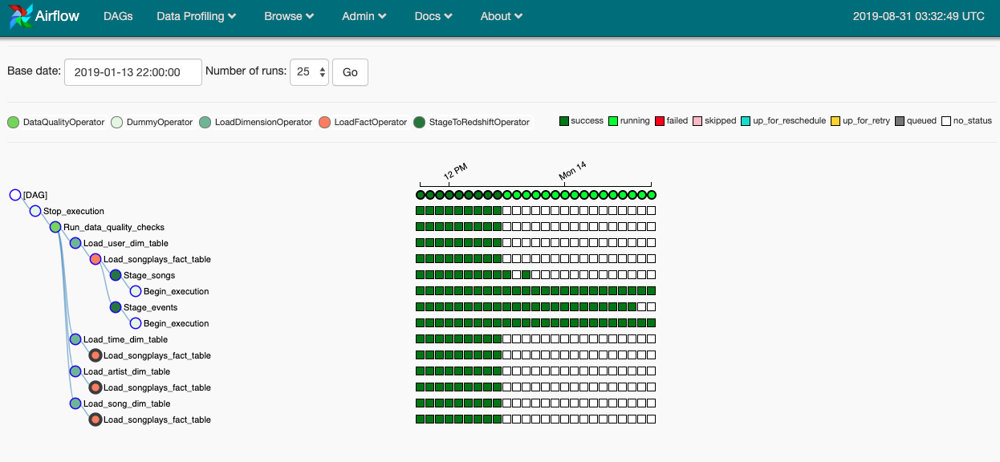

# Sparkify Data Pipelines

## Purpose

Sparkify needs to ensure that it's ETL pipelines are automated, dynamic,built from reusable tasks, easy to maintain and can be monitored to make them production ready. The pipelines also need to ensure that the data is of high quality.

## ETL Process

The current ETL process extracts the data from Amazon S3, stages it in Amazon Redshift and transforms the staged tables into fact and dimension tables for the star schema in Amazon Redshift.

## Solution

Apache Airflow has been selected as the appropriate pipeline management tool to package the code and orchestrate the data pipeline to meet Sparkify's needs.

### DAG

The diagram below show the directed acyclic graph that has been implemented in Airflow to meet the pipeline requirements.

This DAG has been configured with the following default arguments:

1. Owner - Udacity
2. Start Date (schedule start date) - 12/01/2019
3. Depends on past (sequential tasks) - False (parallelizes operations)
4. Retries (number of tries before failure) - 3
5. Retries Delay (wait period between tries) - 5 minutes
6. Catchup (perform scheduler catchup) - False
7. Schedule Interval (frequency) - Hourly

### Operators

To make the pipeline reusable and dynamic a new set of custom parameterizable operators have been developed to execute the tasks.

#### StageToRedshiftOperator

The StageToRedshiftOperator loads files from S3 to Redshift using the SQL COPY statment. This SQL statement is dynamically built from the parameters inserted into each new instance of the operator or a task.

#### LoadFactOperator

The LoadFactOperator takes a Redshift connection and a SQL values statement to load data into a fact table.

#### LoadDimensionOperator

The LoadDimensionOperator takes a Redshift connection, a SQL values statement and an insert method to load data into dimension tables. 

The truncate-insert method is often used to load data into dimension tables given their relatively small sizes. This operator uses truncate as the default option for the insert method however the user can explicity use the append method if so desired.

#### DataQualityOperator

The DataQualityOperator takes a Redshift connection and a table / list of tables to check if the tables have any records. If the tables are empty the operator raises an exception causing the instantiated check task to fail. If the table passes the check the operator logs the number of records in the table.

### Pipeline Execution

The following picture provides a snapshot of the pipeline during execution. The dark green boxes indicate a successful run.

